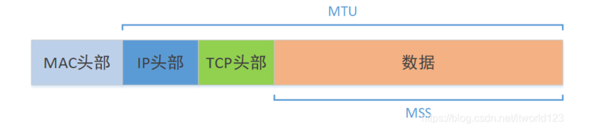
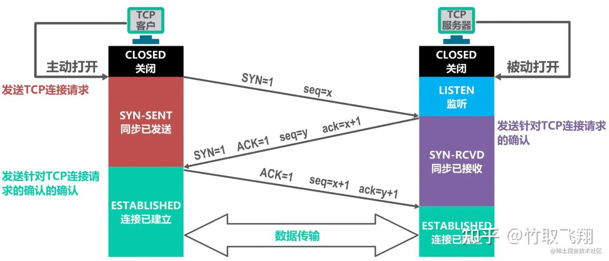
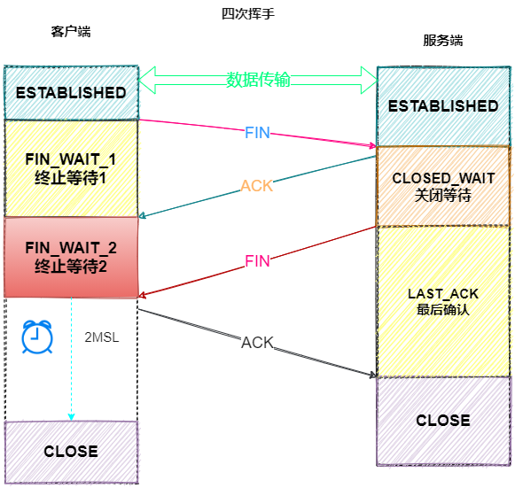

mss(Maximum Segment Size)：最大报文段长度（通常 1460 字节）

Mss为TCP层概念，MTU(Maximum Transmit Unit)是IP层概念，一般大小为1500B



cwnd(Congestion Window)：拥塞窗口，发送方一次最多发送多少数据，单位MSS

rwnd(Receiver Window)：接收端窗口，接受端告诉发送端还能接收多少数据，限制接收频率

ssthresh(Slow Start Threshold)：慢启动阈值。cwnd < ssthresh → 慢启动；cwnd ≥ ssthresh → 拥塞避免。

rtt(Round Time Trip): 往返时间

# TCP

ack是告诉对端，下一个应该给我发啥。

- 没有丢包，收到seq=1000, ack = 1001 (seq+1)
- 丢包，收到seq=1000, seq=1002, seq=10003, 回ack=1001, ack=1001, ack=1001。
## 三次握手

目的：

- 使TCP双方能够确知对方的存在 。
- 使TCP双方能够协商一些参数（ 最大窗口值是否使用窗口扩大选项和时间戳选项，以及服务质量等）。
- 使TCP双方能够对运输实体资源（例如缓存大小连接表中的项目等）进行分配。


- client发了一个SYN=1，seq=x报文，代表是一个TCP Connection Establish的请求，序列号为x（证明client能发）
- server收到了这个报文，要回一个ACK报文，且ack号为收到报文的序列号x+1。同时自己也需要表示要建立TCP Connection，所以SYN=1，生成的seq为y（证明server能发能收）
- client收到server发回来的报文，回了一个ACK报文，seq=x+1，ack号是y+1（证明client能收）
## 四次挥手



# Reno

https://datatracker.ietf.org/doc/html/rfc5681

## 状态转换

```plaintext
初始状态 → 慢启动（cwnd 指数增）
    ↓（cwnd ≥ ssthresh）
拥塞避免（cwnd 线性增）
    ↓（3 个重复 ACK）
快速重传 → 快速恢复（cwnd = ssthresh+3，每重复 ACK+1）
    ↓（收到新数据 ACK）
回到拥塞避免
    ↓（超时 RTO）
任何状态 → 超时处理：cwnd=1，ssthresh=old_cwnd/2 → 慢启动
```

### 慢启动（Slow Start）：指数增长，快速探测带宽

**增长规则：**每收到 1 个新 ACK，cwnd += 1 MSS → 每个 RTT，cwnd 翻倍（指数增长）

Example：initial cwnd=1，第一个RTT，收到1个ack，cwnd=2；第二个RTT，收到2个ack，cwnd=4。

**退出条件：**

- `cwnd ≥ ssthresh` → 进入**拥塞避免**。
- 收到 **3 个重复 ACK** → 进入**快速重传 + 快速恢复**。
- 发生**超时（RTO）** → 进入**超时处理**（退回到慢启动）。
### 拥塞避免（Congestion Avoidance）：线性增长，谨慎探测

**增长规则**：**每个 RTT，cwnd += 1 MSS**（线性增长）。实现：每收到 1 个 ACK，`cwnd += 1 / cwnd` → 一个 RTT 后累计 +1。

**退出条件**：同慢启动（丢包 / 超时）。

### 快速重传（Fast Retransmit）：不等超时，立刻重传

**触发**：连续收到 **3 个重复 ACK**（判定为**单个报文丢失**，非严重拥塞）。

**动作**：

- 立刻重传**丢失的报文段**，不等待 RTO 超时。
- 设置：`ssthresh = max(cwnd/2, 2*MSS)`
- 进入**快速恢复**（不回退到慢启动）。
###  快速恢复（Fast Recovery）：Reno 核心改进，不回退慢启动

- **触发**：快速重传之后。
- **核心规则（RFC 5681）**：
1. `cwnd = ssthresh + 3 * MSS`（补偿 3 个重复 ACK 代表的 “已离开网络的报文”）。
1. 每收到**1 个新的重复 ACK**：`cwnd += 1 MSS`（允许发送新数据，保持管道填充）。
1. 收到**确认新数据的 ACK（完整 ACK）**：
- 退出快速恢复 → `cwnd = ssthresh` → 回到**拥塞避免**。
1. 若发生**超时**：退出快速恢复 → `cwnd = 1 MSS`，`ssthresh = max(old_cwnd / 2, 2 MSS)` → 回到**慢启动**。
## 优缺点

### ✅ 优点

1. **简单鲁棒**：逻辑清晰，实现简单，几乎所有系统默认支持。
1. **公平性好**：多流共享带宽时，能近似公平分配。
1. **兼容广泛**：适配绝大多数网络场景（有线 / 弱网）。
### ❌ 缺点（经典问题）

1. **仅支持单个报文丢失**：一个窗口内**多个报文同时丢失**时，Reno 会误判、多次降窗、吞吐量大幅下降（NewReno 解决此问题）。
1. **依赖丢包作为拥塞信号**：高带宽长延迟网络（BDP 大）下，带宽利用率低。
1. **无 SACK 时恢复慢**：不支持 SACK 时，无法精准定位多个丢包。


# NewReno

https://datatracker.ietf.org/doc/html/rfc6582

## 解决Reno在多丢包场景下的问题

Reno在收到一个新的ack包后，就会退出快速恢复，进入拥塞避免。在这个时候如果又收到了其他包的连续3次ack，又会把cwnd减半，导致吞吐下降

## 方案

记录当前最大发送序列号为recover。

- 只有ack>=recover时，才认为所有丢包恢复，退出快速恢复。
- ack < recover时，留在快速恢复，接着重传下一个未确认的报文，并调整cwnd = cwnd - (已确认字节数/MSS) + 1，重置重传定时器，避免超时。
# Cubic


解决前面的算法在新环境下不能充分利用网络带宽，主要是因为在进入拥塞避免阶段后，它们的拥塞窗口每经过一个RTT才加1，拥塞窗口的增长速度太慢，当碰上高带宽环境时，可能需要经历很多个RTT，拥塞窗口才能接近于一个BDP。如果是短流，可能拥塞窗口还没增长到一个BDP，数据流就已经结束了，致使网络带宽浪费和降低用户体验。


# BBR

https://cloud.tencent.com/developer/article/1482633

https://datatracker.ietf.org/doc/html/draft-cardwell-iccrg-bbr-congestion-control

丢包 不等于 拥塞

```plaintext
        |
        V
+--->Startup----+
|       |       |
|       V       |
|     Drain-----+
|       |       |
|       V       |
+--->ProbeBW----+
|    ^     |    |
|    |     |    |
|    +-----+    |
|               |
+----ProbeRT<---+
```


# TEST