**论文The QUIC Transport Protocol: Design and Internet-Scale Deployment：**https://dl.acm.org/doi/pdf/10.1145/3098822.3098842

**RFC文档：**

https://datatracker.ietf.org/doc/html/rfc9000

**参考相关文章介绍：**

阿里淘系自研标准化协议库 XQUIC 首次公开：直播高峰期卡顿可降低 30%：https://www.infoq.cn/article/sy0kfj2pyjomb6sakqls

科普：QUIC协议原理分析：https://zhuanlan.zhihu.com/p/32553477

阿里CDN QUIC服务介绍：https://help.aliyun.com/zh/cdn/user-guide/what-is-the-quic-protocol

浅析QUIC协议的发展：https://bytetech.info/articles/7111528485474009101?from=lark_all_search

HTTP/2 和 TCP 的缺陷：https://github.com/sisterAn/blog/issues/100

## QUIC简介

### 网络协议回顾

网络协议约束网络通信过程中各方必须按照协议的规定进行通信，以达成全网互联。

网络协议栈各个层次负责不同的事务。应用层针对应用软件进行约束，如网站访问协议HTTP，邮件SMTP等；传输层主要负责数据包在网络中的传输问题，如保证数据传输过程中的安全性，可靠性，丢包处理等；网络层负责将数据包合理的从出发地转发到目的地。

### QUIC历史

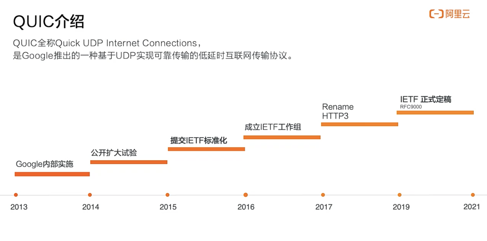

QUIC 是由 Google 从 2013 年开始研究的基于 UDP 的可靠传输协议，它最早的原型是 SPDY + QUIC-Crypto + Reliable UDP，后来经历了 SPDY [1] 转型为 2015 年 5 月 IETF 正式发布的 HTTP/2.0 [2] ，以及 2016 年 TLS/1.3 [3] 的正式发布。QUIC 在 IETF 的标准化工作组自 2016 年成立，考虑到 HTTP/2.0 和 TLS/1.3 的发布，它的核心协议族逐步进化为现在的 HTTP/3.0 + TLS/1.3 + QUIC-Transport 的组合。

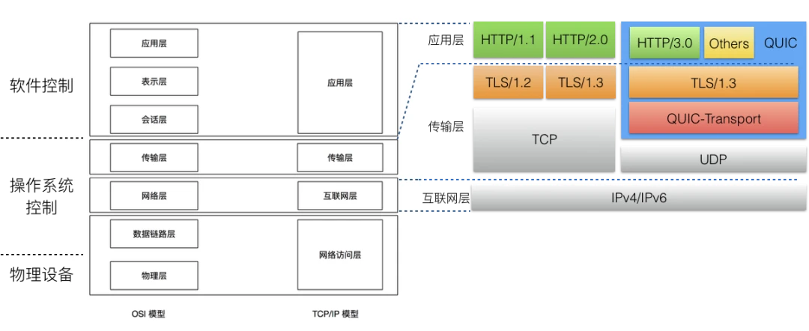

### QUIC业界现状与使用效果

QUIC开源实现列表：https://zhuanlan.zhihu.com/p/270628018

腾讯 TQUIC：https://tquic.net/zh/docs/intro/

阿里 XQUIC：介绍文档：https://www.infoq.cn/article/sy0kfj2pyjomb6sakqls  代码实现：https://github.com/alibaba/xquic?tab=readme-ov-file

华为基于GQUIC进行二次开发（交付给抖音直播使用） -> 自研协议

从公开的数据来看，国内各个厂（腾讯、阿里、字节、华为、OPPO、网易等等）使用了 QUIC 协议后，都有很大的提升，比如网易上了 QUIC 后，响应速度提升 45%，请求错误率降低 50%；比如字节火山引擎使用 QUIC 后，建连耗时降低 20%~30%；比如腾讯使用 QUIC 后，在腾讯会议、直播、游戏等场景耗时也降低 30%；

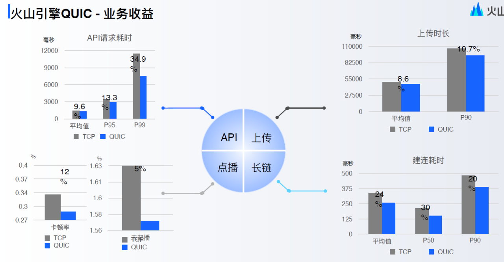

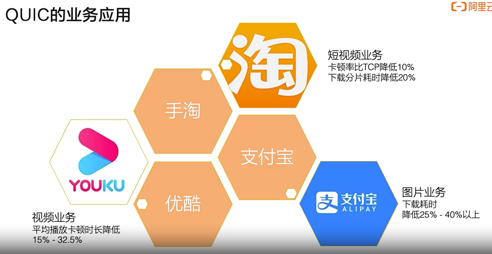

## 网络传输痛点

### 建立连接时握手时间长

TCP通过三次握手建立TCP连接，等于1.5RTT(Round Time Trip).

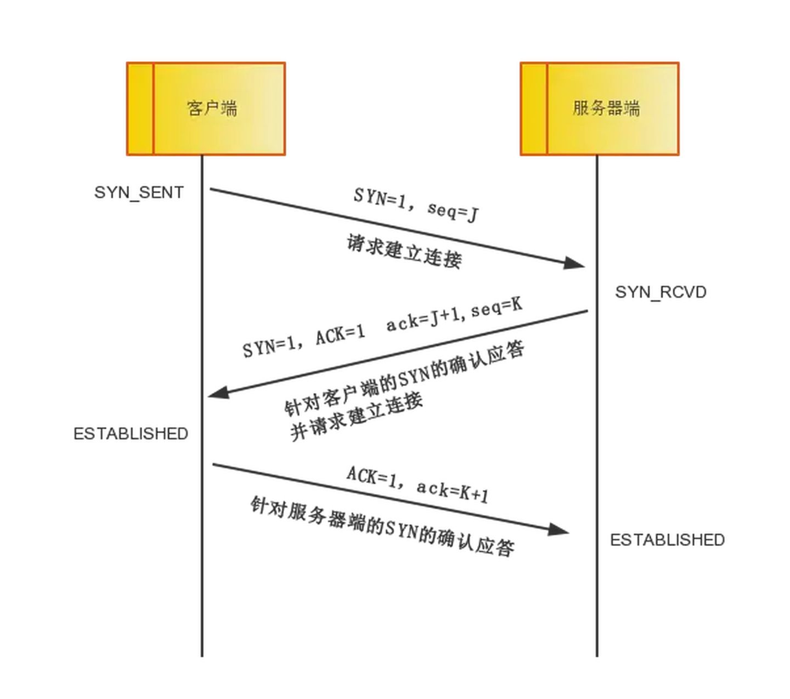

tls1.2协议的握手，需要2个RTT。

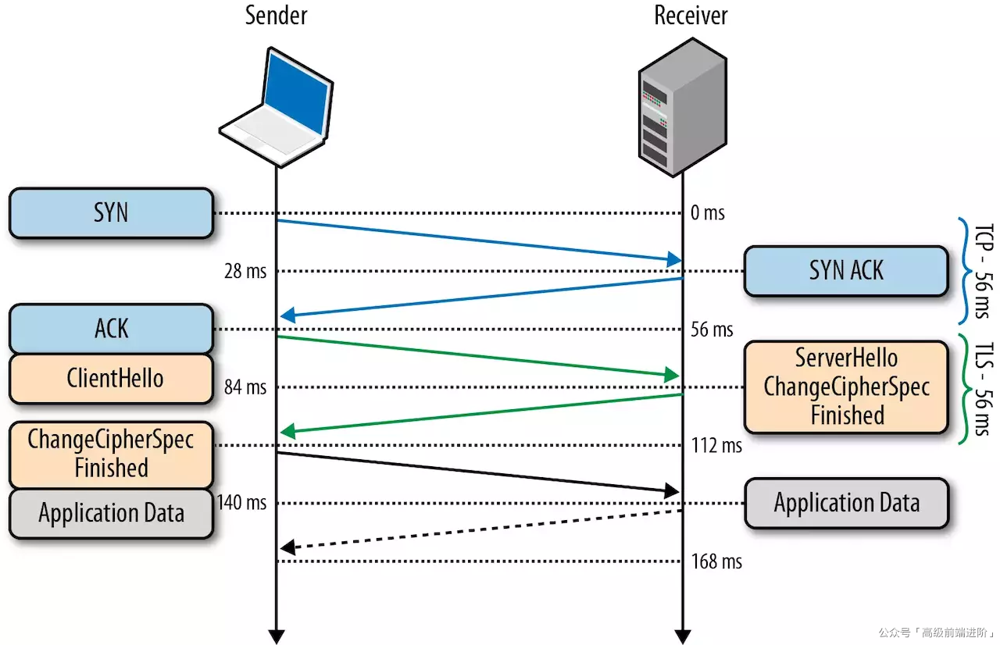

- **一去：**客户端发送一个随机数 C，客户端的 TLS 版本号以及支持的密码套件列表给服务器端
- **二回：**服务端收到客户端的随机值，自己也产生一个随机值 S ，并根据客户端需求的协议和加密方式来使用对应的方式，并且发送自己的证书（如果需要验证客户端证书需要说明）
- **三去：**客户端收到服务端的证书并验证是否有效，验证通过会再生成一个随机值 pre-master，通过服务端证书的公钥去加密这个随机值并发送给服务端。如果服务端需要验证客户端证书的话会附带证书（双向认证，比如网上银行用 U 盾）
- **四回：** 服务端收到加密过的随机值并使用私钥解密获得第三个随机值，这时候两端都拥有了三个随机值，可以通过这三个随机值（C/S 加 pre-master 算出主密钥）按照之前约定的加密方式生成密钥，接下来的通信就可以通过该会话密钥来加密解密
注意：在 TLS 1.3 协议中，首次建立连接只需要一个 RTT，后面恢复连接不需要 RTT 了

HTTPS 通信时间总和（基于TLS1.2） = TCP 建立连接时间 + TLS1.2 连接时间 + HTTP交易时间 = 1 RTT + 2 RTT + 1 RTT = 4 RTT

HTTPS 通信时间总和（基于TLS1.3） = TCP 建立连接时间 + TLS1.3 连接时间 + HTTP交易时间 = 1 RTT + 1 RTT + 1 RTT = 3 RTT

如果服务器距离客户端很近，RTT 时间较短 < 10ms，那么 HTTPS 通信时间也不会超过 40 ms，用户感知不明显，但如果距离较远，相隔上万公里，一个 RTT 时间通常在200ms以上，那么 HTTPS 通信将花费 800ms 甚至 1s 以上，这就严重影响到用户体验了。

### 队头阻塞

以 HTTP/2 多路复用为例，多个数据请求在同一个 TCP 连接上作为不同的流发送，应用层的所有流都必须按顺序处理。如果一个流的数据丢失，后面的其他流的数据将被阻塞，直到丢失的数据被重传，即使接收端已经收到后续流的数据包，也不会通知应用层。此问题称为 TCP 流的队头阻塞 (HoL)。

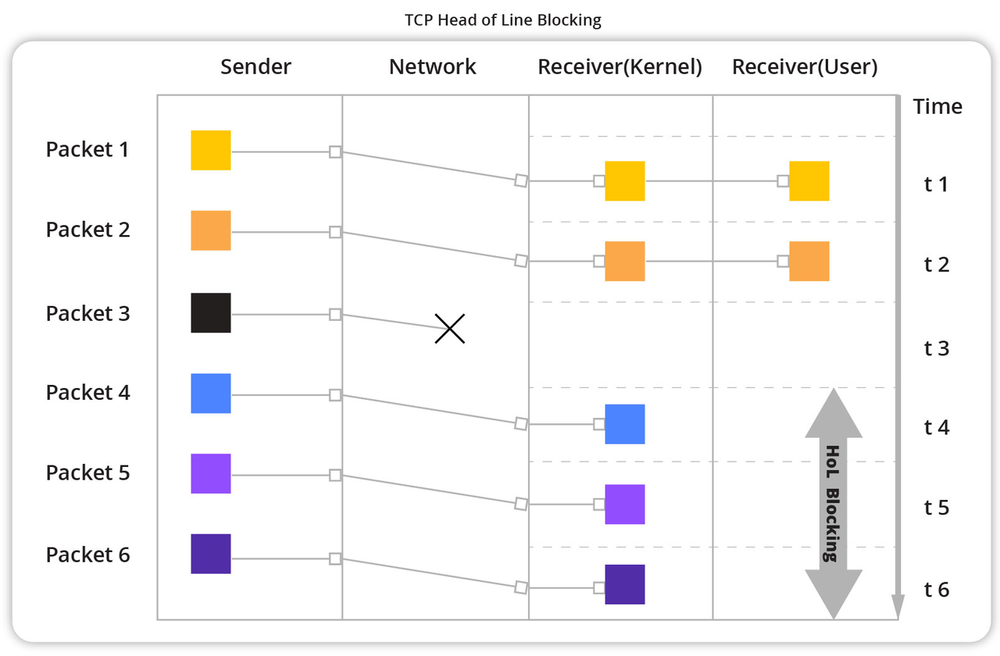

### 内核态协议栈导致的协议实现/算法落后

TCP 是由操作系统在内核层面实现的，应用程序只能使用，不能直接修改。虽然应用程序的更新迭代非常快速和简单。但是 TCP 的迭代却非常缓慢，原因就是操作系统升级很麻烦。

现在移动终端更加流行，但是移动端部分用户的操作系统升级依然可能滞后数年时间。PC 端的系统升级滞后得更加严重，windows xp 现在还有大量用户在使用，尽管它已经存在快 20 年。

服务端系统不依赖用户升级，但是由于操作系统升级涉及到底层软件和运行库的更新，所以也比较保守和缓慢。

这也就意味着即使 TCP 有比较好的特性更新，也很难快速推广。比如 TCP Fast Open。它虽然 2013 年就被提出了，但是 Windows 很多系统版本依然不支持它

从拥塞控制算法视角来看，TCP的拥塞控制算法主要是慢启动、拥塞避免、快速重传和快速恢复，这些算法虽然都很经典，但都是几十年前提出的，对于当时那种有线低速网络为主的环境很适用，但是随着科技的发展，现在基本都是无线高速网络为主，TCP这些拥塞算法不仅落伍，甚至还会带来副作用，导致网络阻塞更加严重，究其原因，还是没有跟上时代的步伐而进步。

### 重传二义性

tcp的重传二义性：每发出一个报文段，TCP就设定超时重传定时器并等待确认信息，如果在报文段中的数据未确认之前定时器超时，TCP就认为该报文段已经丢失或出现损坏，从而重传这一报文段。但是，存在着这样的一种情况，TCP数据报文段重发后，当确认到达的时侯，无法确定这次确认是对于首次发送的报文的确认，还是对于后来重发的报文的确认，即TCP重传二义性问题，这个二义性会带来一个RTT测量不准的问题，如下图所示：

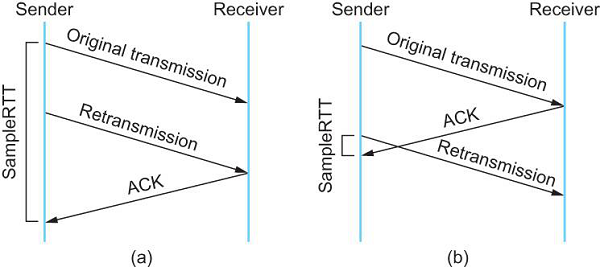

可以看到无论是图a还是图b。都存在上述说的二义性问题，要么测量出来的RTT过大，要么测量出来的RTT过小，这对于测量RTT来说都是不可预估的风险，而RTT对于网络传输又是非常的重要

目前二义性问题其实是有解决方案的，要么就是打开TCP时间戳选项，但是打开这个选项后也许会引入别的问题，要么就是Karn算法或者是其改进版的算法，这个算法还是蛮复杂的，有兴趣的同学可以专门去看看，这里就不再展开来讲了

总而言之TCP是没有彻底解决好二义性问题，也算是TCP的一个遗留问题

## QUIC的优势

### “0RTT”连接建立

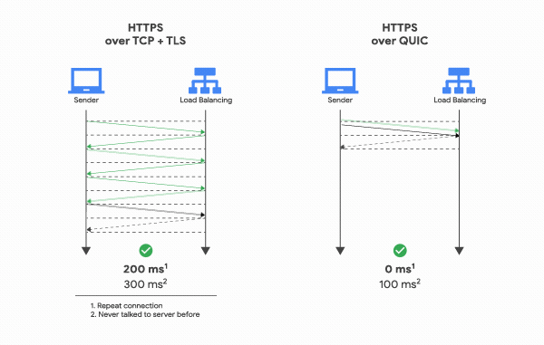

QUIC在两个方面进行了优化：

- 传输层使用UDP，减少了TCP三次握手中一个1-RTT的延迟。
- 采用最新版本的 TLS 协议，TLS 1.3，允许客户端在 TLS 握手完成之前发送应用数据，同时支持 1-RTT 和 0-RTT。使用 QUIC 协议，第一次握手协商需要 1-RTT，但之前连接的客户端可以使用缓存信息恢复 TLS 连接，只需 0RTT。
**改善场景：**

1. 视频首帧时延（客户端访问服务端视频第一帧的时间）
1. HTTP访问等短连接情况。
### 改进多路复用

QUIC 的多路复用类似于 HTTP/2。可以在单个 QUIC 连接上同时发送多个 HTTP 请求（流）。然而，让 QUIC 的多路复用超越 HTTP/2 的是，在单个连接上每个流之间没有顺序依赖。这意味着如果流 2 丢失了一个 UDP 数据包，它只会影响流 2 的处理，不会阻塞流 1 和 3 的数据传输。因此，该解决方案不会导致 Head-of-Line Blocking。

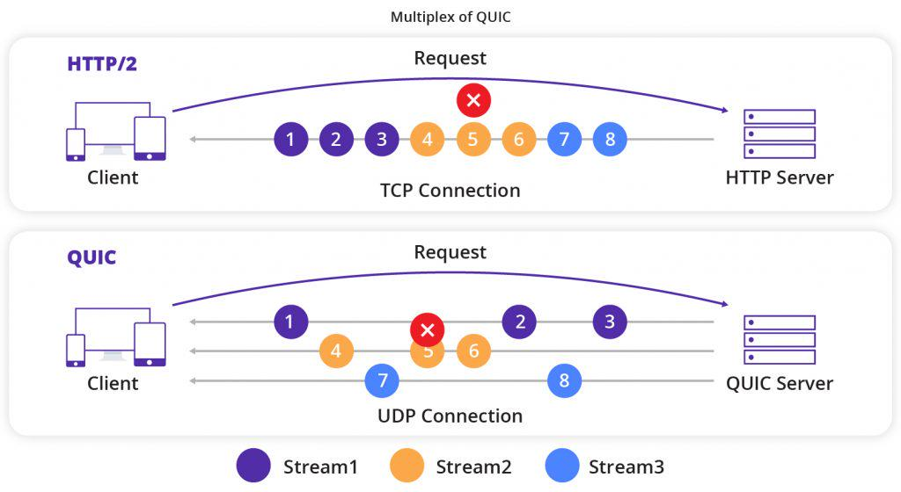

**改善场景：**

1. 相同网络情况下，解决队头阻塞的问题，传输效率更高
1. 影响视频卡顿率 -> 影响视频完播率，差评率 -> 购买转换率，复购率等
### 用户态协议栈

用户态协议栈能够非常灵活地支持拥塞算法生效，变更和停止。体现在如下方面：

1. 应用程序层面就能实现不同的拥塞控制算法，不需要操作系统，不需要内核支持。这是一个飞跃，因为传统的 TCP 拥塞控制，必须要端到端的网络协议栈支持，才能实现控制效果。而内核和操作系统的部署成本非常高，升级周期很长，这在产品快速迭代，网络爆炸式增长的今天，显然有点满足不了需求。
1. 即使是单个应用程序的不同连接也能支持配置不同的拥塞控制。就算是一台服务器，接入的用户网络环境也千差万别，结合大数据及人工智能处理，我们能为各个用户提供不同的但又更加精准更加有效的拥塞控制。
1. 应用程序不需要停机和升级就能实现拥塞控制的变更，我们在服务端只需要修改一下配置，reload 一下，完全不需要停止服务就能实现拥塞控制的切换。
除却在拥塞控制算法方面的自定义选择，还可以针对不同业务，不同网络制式，甚至不同的 RTT，对协议参数，协议特定的机制进行自定义开发和调优。

### 解决重传二义性

首先要明确一个概念，QUIC中报文有Packet Number的概念，并且Packet Number是严格单调递增的，这样就能轻松解决重传二义性的问题了，如下面所示：

通过单调递增的Packet Number，可以轻松地分辨出ACK是对原始报文还是对重传报文的确认，因此也就可以得到较为准确的RTT测量值，避免重传二义性问题

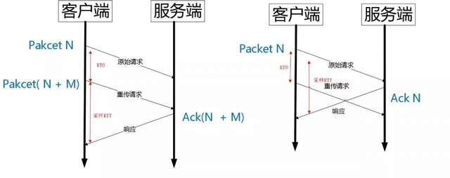

### **其它优点**

除了上面提到的一些改进外，QUIC还有一些很给力的特性：

**协议头部的加密处理**：我们知道TCP协议头部是没有经过任何加密和认证的，这就会带来一定的安全隐患。一些中间网络设备就可以对报文头进行注入和窃听，比如说修改端口号或一些标记位等等，QUIC则对所有的报文头部都进行了认真，对报文内容进行了加密，在中间传输环节如果发现报文被修改过，接收方都是可以及时发现的，这就大大降低了安全风险

**连接迁移**：TCP连接是由四元组唯一确定的，也就是说如果其中某个元素发生变化后，这个连接就不能再使用，需要重新建立新的四元组TCP连接，而QUIC在连接迁移方面，则是通过一个64位的随机数作为ID，也就是Connection ID，这样即使四元组发生了变化，只要ID不变，则连接也不会改变，也就不需要重连。

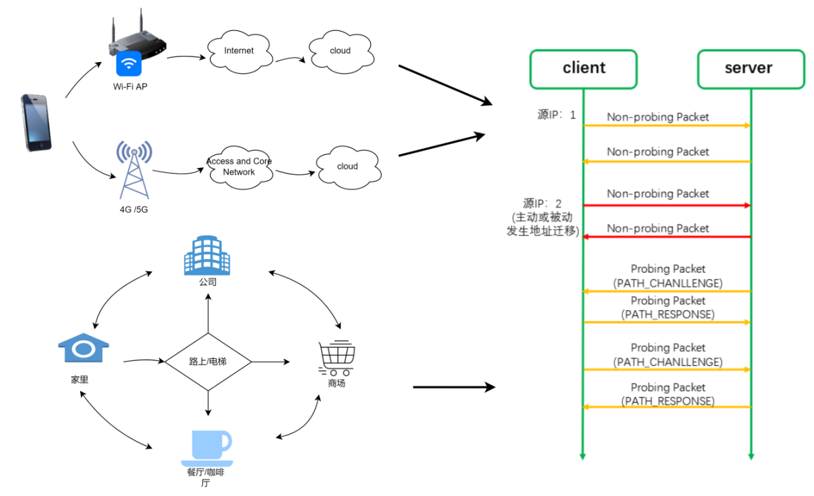

除此之外，QUIC还实现了前向冗余纠错、证书压缩、报文头校验等功能

## QUIC使用过程中遇到的挑战与解决方案

### UDP 被限速或禁闭

业内统计数据全球有 7%地区的运营商对 UDP 有Qos限制或者禁闭，除了运营商还有很多企业、公共场合也会限制 UDP 流量甚至禁用 UDP。运营商这么做主要基于两个原因：

1. UDP流量五元组在NAT状态上连接老化的时间控制不够精确，时间设置太长会破坏低频通信的UDP连接，太短会导致UDP连接消耗比较多的设备性能。一般会选择一个折中的经验值，这就会伤害一些特定场景的UDP流量了。
1. 运营商设备上包分类的优先级队列对于UDP五元组的管理比较困难，因为UDP的五元组会频繁变动，只能眼睁睁看着UDP流量挤占各级队列，却没办法实施精确地控制。一般来说，运营商会在特定时间段或者特定负载情况下对UDP流量做全局限制。
对此，我们可以采用多路竞速的方式使用 TCP 和 QUIC 同时建连。除了在建连进行竞速以外，还可以对网络 QUIC 和 TCP 的传输延时进行实时监控和对比，如果有链路对 UDP 进行了限速，可以动态从 QUIC 切换到 TCP。

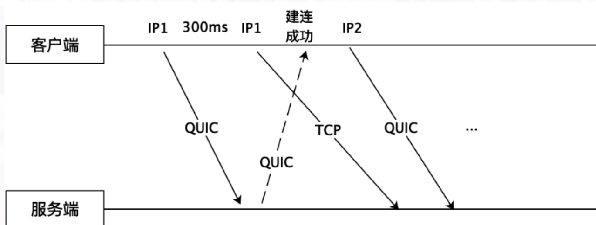

### QUIC 对 CPU 消耗大

相对于 TCP，为什么 QUIC 更消耗资源？

1. QUIC 在用户态实现，需要更多的内核空间与用户空间的数据拷贝和上下文切换；
1. QUIC 的 ACK 报文也是加密的，TCP 是明文的。
1. 内核知道 TCP 连接的状态，不用为每一个数据包去做诸如查找目的路由、防火墙规则等操作，只需要在 tcp 连接建立的时候做一次即可，然而 QUIC 不行；
总的来说，QUIC 服务端消耗 CPU 的地方主要有三个：密码算法的开销；udp 收发包的开销；协议栈的开销；

针对这些，我们可以适当采取优化措施来：

1. 使用 Intel 硬件加速卡卸载 TLS 握手
1. 开启 GSO 功能。
1. 数据在传输过程中，可以将一轮中所有的 ACK 解析后再同时进行处理，避免处理大量的 ACK。
1. 适当将 QUIC 的包长限制调高（比如从默认的 1200 调到 1400 个字节）
1. 减少协议栈的内存拷贝（xdp/dpdk)
## QUIC具体实现

RFC9000: https://datatracker.ietf.org/doc/html/rfc9000

RFC9000 中文文档：https://autumnquiche.github.io/RFC9000_Chinese_Simplified/