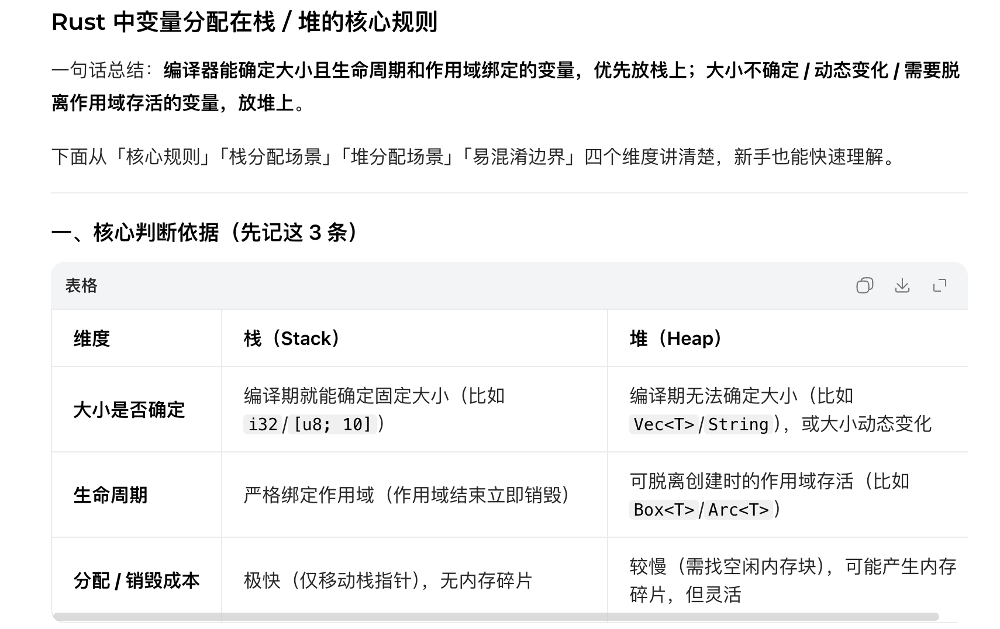
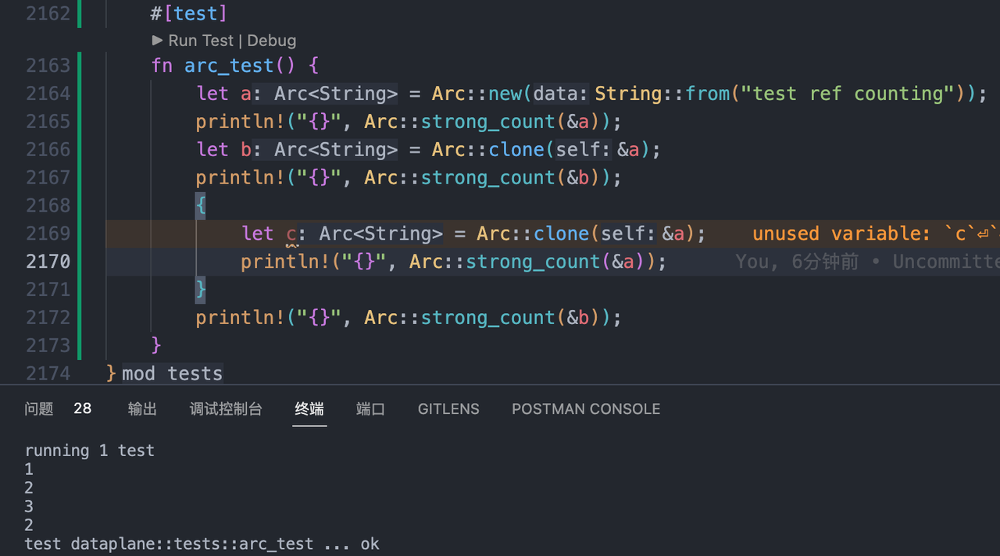
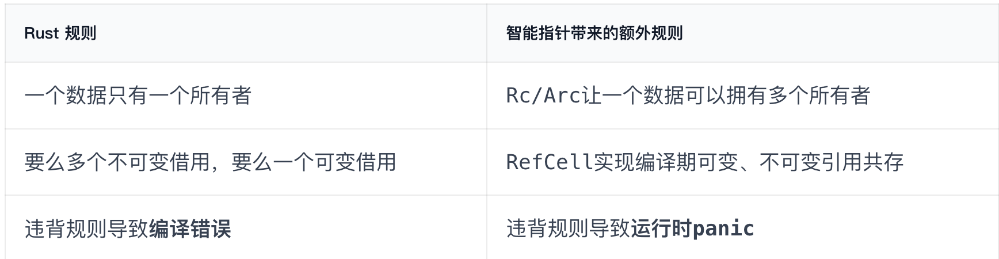

<https://doc.rust-lang.org/stable/book/index.html>

<https://beatai.org/rust-course/advance-practice/async>

# 其他语言对比

- **垃圾回收机制(GC)**，在程序运行时不断寻找不再使用的内存，典型代表：Java、Go
- **手动管理内存的分配和释放**, 在程序中，通过函数调用的方式来申请和释放内存，典型代表：C++
- **通过所有权来管理内存**，编译器在编译时会根据一系列规则进行检查

# 特性

## 所有权

每个对象都有所有权，当发生所有权转移时，原先指向对象的指针就失效了，无法再访问。除非实现了Copy特征。

```scheme
let v = vec![1, 2, 3];
let v2 = v;
println!("v[0] is: {}", v[0]);
```

报错，v无法被访问

```scheme
fn main() {
    let a = 5;
    let _y = double(a);
    println!("{}", a);
}

fn double(x: i32) -> i32 {
    x * 2
}
```

正常执行，i32s实现了Copy特征。实际上在赋值时，进行了一次深拷贝。

## 引用

不使用引用时，为了让作为入参的所有权归还出来，需要在返回值里带上入参

```scheme
fn foo(v1: Vec<i32>, v2: Vec<i32>) -> (Vec<i32>, Vec<i32>, i32) {
    // do stuff with v1 and v2
    // hand back ownership, and the result of our function
    (v1, v2, 42)
}

let v1 = vec![1, 2, 3];
let v2 = vec![1, 2, 3];

let (v1, v2, answer) = foo(v1, v2);
```

使用引用来解决这个问题。

```scheme
fn foo(v1: &Vec<i32>, v2: &Vec<i32>) -> i32 {
    // do stuff with v1 and v2
    // return the answer42
}

let v1 = vec![1, 2, 3];
let v2 = vec![1, 2, 3];

let answer = foo(&v1, &v2);
```

引用正常是不可变的，如果需要修改引用的对象，需要使用\&mut，可变引用

```scheme
let mut x = 5;
{
    let y = &mut x;
    *y += 1;
}
println!("{}", x);
```

**引用存在几条规则**

- **任何引用的声明周期不得长于所有者**

```scheme
let y: &i32;
let x = 5;
y = &x;  // 报错，y声明周期长于x

println!("{}", y); 
```

- **不能同时存在可变引用和不可变引用（避免data race）**

```scheme
let mut x = 5;
let y = &mut x;
*y += 1;
println!("{}", x); // 报错，同时存在可变引用y，和println中隐式调用了x的引用
```

## 生命周期

Typical case：

1. A作为数据所有者获取数据
2. A将数据借给B
3. A使用完数据free
4. B使用数据
   这种情况下会导致空指针。为解决这个问题，引入生命周期的概念。

**函数声明声明周期**

```scheme
// implicit
fn foo(x: &i32) {
}

// explicit
fn bar<'a>(x: &'a i32) {
}
```

**结构体声明声明周期**

```scheme
struct Foo<'a> {
    x: &'a i32,
}

fn main() {
    let y = &5; // this is the same as `let _y = 5; let y = &_y;`let f = Foo { x: y };
    println!("{}", f.x);
}
```

确保对Foo的声明周期引用不长于x的引用。

**'static 代表整个程序生命周期**

# 语法

## 结构体

\#\[derive(Debug)]

通常对结构体进行打印需要重写Display特征，通过在结构体定义上方添加#\[derive(Debug)]标识，可以通过如下命令，按照默认方式进行打印

```scheme
println!("structContext is {:?}", selfDefinedStruct);
```



## 智能指针

\*\*指针：\*\*一个包含了内存地址的变量，该内存地址引用或指向了另外的数据

rust里常见的指针类型是引用（&）。&还代表了借用其他变量的值。

**智能指针：**

1. 比引用更复杂的数据结构，包含更多信息，如原数据，当前长度，最大可用长度等（基于结构体实现）。
2. 实现了Deref和Drop特征：

- `Deref` 可以让智能指针像引用那样工作，这样你就可以写出同时支持智能指针和引用的代码，例如 `*T`
- `Drop` 允许你指定智能指针超出作用域后自动执行的代码，例如做一些数据清除等收尾工作

### Box<T>

`Box<T>` 允许将一个值分配到堆上，然后在栈上保留一个智能指针指向堆上的数据

**堆栈性能：**

- 小型数据，在栈上的分配性能和读取性能都要比堆上高
- 中型数据，栈上分配性能高，但是读取性能和堆上并无区别，因为无法利用寄存器或 CPU 高速缓存，最终还是要经过一次内存寻址
- 大型数据，只建议在堆上分配和使用

```scheme
fn main() {
    // 在栈上创建一个长度为1000的数组
    let arr = [0;1000];
    // 将arr所有权转移arr1，由于 `arr` 分配在栈上，因此这里实际上是直接重新深拷贝了一份数据
    let arr1 = arr;

    // arr 和 arr1 都拥有各自的栈上数组，因此不会报错
    println!("{:?}", arr.len());
    println!("{:?}", arr1.len());

    // 在堆上创建一个长度为1000的数组，然后使用一个智能指针指向它
    let arr = Box::new([0;1000]);
    // 将堆上数组的所有权转移给 arr1，由于数据在堆上，因此仅仅拷贝了智能指针的结构体，底层数据并没有被拷贝
    // 所有权顺利转移给 arr1，arr 不再拥有所有权
    let arr1 = arr;
    println!("{:?}", arr1.len());
    // 由于 arr 不再拥有底层数组的所有权，因此下面代码将报错
    // println!("{:?}", arr.len());
}
```

在 Rust 中，想实现不同类型组成的数组只有两个办法：枚举和特征对象，前者限制较多，因此后者往往是最常用的解决办法。

```scheme
trait Draw {fn draw(&self);
}

struct Button {
    id: u32,
}
impl Draw for Button {fn draw(&self) {println!("这是屏幕上第{}号按钮", self.id)
    }
}

struct Select {
    id: u32,
}

impl Draw for Select {fn draw(&self) {println!("这个选择框贼难用{}", self.id)
    }
}

fn main() {let elems: Vec<Box<dyn Draw>> = vec![Box::new(Button { id: 1 }), Box::new(Select { id: 2 })];
for e in elems {
        e.draw()
    }
}
```

消费掉 `Box` 并且强制目标值从内存中泄漏

```scheme
fn main() {
    let s = gen_static_str();println!("{}", s);
}

fn gen_static_str() -> &'static str{
    let mut s = String::new();
    s.push_str("hello, world");
    Box::leak(s.into_boxed_str())
}
```

可以让函数在运行期返回一个具有static生命周期的\&str字符串切片

### Rc && Arc

rust的安全机制要求一个值只能拥有一个所有者。但是在某些场景需要满足一个数据资源在同一时刻拥有多个所有者，如：

- 图数据结构中，多个边共同拥有一个节点
- 多线程中，多个线程共同持有一个数据，同时获取该数据的可变引用
  Rc<T>：引用计数(reference counting)，顾名思义，通过记录一个数据被引用的次数来确定该数据是否正在被使用。当引用次数归零时，就代表该数据不再被使用，因此可以被清理释放。Arc<T>是Rc<T>的 原子/多线程版本。

Rc::clone()只复制了智能指针并增加了引用计数，并没有克隆底层的数据（可视为浅拷贝，效率非常高）



### Cell && RefCell

允许在拥有不可变引用的时候，修改引用（不可变引用和可变引用共存）。



主要用来解决：1. rust的安全检查太严格了导致的编译误报；2. 内部可变性

```scheme
use std::cell::RefCell;

// 定义在外部库中的特征
pub trait Messenger {
    fn send(&self, msg: String);
}

pub struct MsgQueue {
    msg_cache: RefCell<Vec<String>>,
}

impl Messenger for MsgQueue {
    fn send(&self, msg: String) {
        self.msg_cache.borrow_mut().push(msg)
    }
}

fn main() {
    let mq = MsgQueue {
        msg_cache: RefCell::new(Vec::new()),
    };
    mq.send("hello, world".to_string());
}
```

和Rc组合起来之后，就可以实现一个对象存在多个所有者后，也可以修改对象的值。

Cell需要指针对象实现Copy特征，RefCell不需要，是用的引用。所以RefCell比Cell性能略差一些，因为包含了一个字节大小的“借用状态”指示器，该指示器在每次运行时借用时都会被修改。

# Unsafe Rust

```scheme
fn main() {
    let mut num = 5;

    let r1 = &num as *const i32;

    unsafe {
        println!("r1 is: {}", *r1);
    }
}
```

unsafe允许我们：

- 解引用裸指针（创建裸指针是安全的行为，解引用不安全）
- 调用一个 `unsafe` 或外部的函数
- 访问或修改一个可变的\_\_静态变量\_\_
- 实现一个 `unsafe` 特征
- 访问 `union` 中的字段

## 获取多次可变引用

```scheme
use std::slice;

fn split_at_mut(slice: &mut [i32], mid: usize) -> (&mut [i32], &mut [i32]) {
    let len = slice.len();
    let ptr = slice.as_mut_ptr();
    assert!(mid <= len);
    unsafe {
        (
            slice::from_raw_parts_mut(ptr, mid),
            slice::from_raw_parts_mut(ptr.add(mid), len - mid),
        )
    }
}

fn main() {
    let mut v = vec![1, 2, 3, 4, 5, 6];
    let r = &mut v[..];
    let (a, b) = split_at_mut(r, 3);
    assert_eq!(a, &mut [1, 2, 3]);
    assert_eq!(b, &mut [4, 5, 6]);
}
```

## FFI

```scheme
extern "C" {
    fn abs(input: i32) -> i32;
}

fn main() {
    unsafe {
        println!("Absolute value of -3 according to C: {}", abs(-3));
    }
}
```

# 并发编程

<https://rust-lang.github.io/async-book/part-guide/concurrency.html>

<https://huangjj27.github.io/async-book/01_getting_started/02_why_async.html>

## 并发(Concurrency) Vs 并行(Parallelism)

Concurrency is about **ordering of computations** and parallelism is about the **mode of execution**.

\*\*同步：\*\*吃饭吃到一半，电话来了，一直到吃完了以后才去接，这就说明不支持并发也不支持并行。

\*\*并发：\*\*吃一会饭，再去打一会电话，然后再继续吃饭，如果速度足够快，就给人一种吃饭打电话同时进行的感觉，

\*\*并行：\*\*吃饭吃到一半，电话来了，你一边打电话一边吃饭，说明你支持并行。

并发的关键是你有处理多个任务的能力，不一定要同时。

并行的关键是你有同时处理多个任务的能力。

所以我认为它们最关键的点就是：是否是『同时』。

## 并发编程的类型

## 异步模型

异步模型是并发编程的一种，主要是为了解决传统多线程模型在“高并发，高IO等待”情况下的效率和资源瓶颈，主要解决：

- 传统多线程的 “重量级” 并发瓶颈：线程资源有限。一个线程的内存占用在1M-8M，创建/销毁、上下文切换的成本高。异步模型通过轻量级异步任务Future task替代thread，能够在一个线程里承载许多的异步任务。
- 线程阻塞导致的资源利用率极低：IO 等待时线程闲置
- 传统多线程的同步复杂度：锁与竞态条件
  与多线程模型对比实现上有些区别，异步是靠程序，不靠操作系统，并且多任务的处理是“合作式（cooperative）”而不是“抢占式（pre-emptive）”

异步并发是合作式的，可以人为决定在哪里pause，不会异常的pause。但也有可能会一直pause，导致其他的任务无法被执行。异步并发被认为是更高效的，原因是无需将控制权交给OS，又交回给程序，并且会减少上下文的切换。

从整个系统的角度来看，多线程并发系统中的阻塞式IO与异步并发系统中的非阻塞式IO是相似的。在这两种情况下，IO操作都需要耗时，且在IO执行期间，其他任务可以正常运行：

- 在多线程模型中，执行IO操作的线程向操作系统发起IO请求，该线程会被操作系统挂起，其他线程则继续执行任务；当IO操作完成后，操作系统会唤醒该线程，使其能够基于IO结果继续执行。
- 在异步模型中，执行IO操作的任务向runtime发起IO请求，runtime再向OS发起IO请求，而操作系统会将控制权交还给runtime。runtime会暂停该IO任务，并调度其他任务执行；当IO操作完成后，运行时会唤醒该IO任务，使其能够基于IO结果继续执行。
  多线程与异步并非互斥：许多程序会同时使用二者。有些程序中，部分逻辑更适合用线程实现，另一部分则更适合用异步实现。例如，数据库服务器可采用异步技术管理与客户端的网络通信，而使用操作系统线程处理数据计算。反之，一个程序即便仅采用异步并发，其运行时也会在多个线程上执行任务——这是程序利用多核CPU的必要条件。

### 关键概念

**async**

是标记一个函数为异步函数或代码块为异步。这里仅是“使能”函数具有异步能力，区别于同步IO线程完全阻塞，需要等待IO完成后才可执行；能在执行IO操作时，将线程的所有权让出去。但实际让不让，怎么让，是调用方式决定\*\*。\*\*

**await**

调用async函数/代码块

示例如下

```scheme
use std::time::{Duration, Instant};
use tokio::time::sleep;
use tokio::{join, select};

// 模拟异步IO（sleep代表IO等待）
async fn async_io_task(name: &str, wait_secs: u64) {
    let start = Instant::now();
    println!("[{}] 开始执行异步IO，等待 {}s...", name, wait_secs);

    // 核心：非阻塞等待（让出线程）
    sleep(Duration::from_secs(wait_secs)).await;

    println!("[{}] IO完成，耗时: {:?}", name, start.elapsed());
}

#[tokio::test]
async fn test_async() {
    // 测试1：串行await
    let serial_start = Instant::now();
    async_io_task("任务1", 2).await;
    async_io_task("任务2", 1).await;
    println!("串行await总耗时: {:?}\n", serial_start.elapsed()); // ≈3s

    // 测试2：join!组合（无spawn）
    let join_start = Instant::now();
    join!(async_io_task("任务1", 2), async_io_task("任务2", 1));
    println!("join!组合总耗时: {:?}\n", join_start.elapsed()); // ≈2s

    // 测试3：select!组合（无spawn）
    let join_start = Instant::now();
    select! {
      _ = async_io_task("任务1", 2) => {      }
      _ = async_io_task("任务2", 1) => {     }
    }
    println!("join!组合总耗时: {:?}\n", join_start.elapsed()); // ≈1s

    // 测试4: spawn
    let spawn_start = Instant::now();
    let handle1 = tokio::spawn(async_io_task("任务1", 2));
    let handle2 = tokio::spawn(async_io_task("任务2", 1));
    handle1.await.unwrap();
    handle2.await.unwrap();
    println!("spawn!组合总耗时: {:?}", spawn_start.elapsed()); // ≈2s
}

```

case1 中 await调用是串行的，第二个任务需要等待第一个任务执行完成后才启动，在任务一的sleep阶段没有其他的任务可处理。

**join!() && try\_join!()：单线程式调用异步**

case2 中使用tokio::join!()这一future组合器，在同一个线程（单线程）里驱动多个async函数的Future执行，当一个Future等待IO时，线程会让出，驱动另一个Future执行。

try\_join!对比join，可以用于获取err

**select! && try\_select!()：只要有其中一个异步任务返回**就终止。

**spawn!()：多线程式的调用异步**

case3 中使用tokio::spawn()，把任务提交到多线程池，多线程并发执行。

```scheme
[任务1] 开始执行异步IO，等待 2s...
[任务1] IO完成，耗时: 2.002492125s
[任务2] 开始执行异步IO，等待 2s...
[任务2] IO完成，耗时: 2.002099042s
串行await总耗时: 4.004688459s

[任务1] 开始执行异步IO，等待 2s...
[任务2] 开始执行异步IO，等待 2s...
[任务2] IO完成，耗时: 2.001648958s
[任务1] IO完成，耗时: 2.001701875s
join!组合总耗时: 2.001731833s

[任务1] 开始执行异步IO，等待 2s...
[任务2] 开始执行异步IO，等待 2s...
[任务1] IO完成，耗时: 2.001157333s
[任务2] IO完成，耗时: 2.001182333s
spawn!组合总耗时: 2.001240291s
```

```scheme
#[tokio::test]
async fn test_select() {
    select! {
      _ = async_io_task("任务1", 2) => {
        println!("computation completed and returned");
      }
      _ = async_io_task("任务2", 2) => {
        println!("computation timed-out");
      }
    }
}

```

**async move**的含义是将外部变量的所有权转移到future内部。

比如在tokio::spawn场景下，如果引用了外部变量，就需要做move操作。原因是tokio::spawn()会将任务提交到线程池，脱离当前上下文；而spawn的核心约束是，需要生命周期是'static，因为task的执行时间和执行完成时间都是不确定的。此外，其他存在生命周期不确定的场景，比如转移到不同线程执行时，都需要进行所有权转移。

### 深入异步

**Future**

A future is a regular rust object impl 'Future' trait.表示延迟计算。异步的内核是实现了Future trait。

```scheme
trait SimpleFuture {
    type Output;
    fn poll(&mut self, wake: fn()) -> Poll<Self::Output>;
}

enum Poll<T> {
    Ready(T),
    Pending,
}
```

调用.await()时，会调用当前 Future 的`poll`方法。如果返回`Pending`，则保存当前执行状态，让出线程；

等 Waker 唤醒后，从`await`的位置继续执行

**Wake唤醒流程**

```scheme
// 异步任务中的 sleep.await
async fn my_task() {
    println!("任务开始");
    tokio::time::sleep(Duration::from_secs(1)).await; // 暂停点
    println!("任务被唤醒，继续执行");
}

// 提交任务到 Tokio
tokio::spawn(my_task());
```

1. 任务首次 poll，注册 Waker 并暂停

- tokio 的 Worker 线程调用 `my_task` 生成的 Future 的 `poll` 方法；
- 执行到 `sleep.await` 时，会调用 `tokio::time::Sleep` 这个 Future 的 `poll` 方法；
- `Sleep` 的 `poll` 方法检查：“定时器是否到期？”（此时未到期）；
- `Sleep` 向 Tokio 的**定时器模块**注册一个 “1 秒后触发” 的事件，并把当前的 Waker（来自 `poll` 的 `Context` 参数）绑定到这个事件上；
- `Sleep` 的 `poll` 返回 `Poll::Pending`，告诉 Worker 线程：“我暂时无法完成，先处理其他任务吧”；
- Worker 线程放弃这个任务，去处理队列中的其他任务。

1. 定时器事件完成，触发 Waker

- 1 秒后，Tokio 的定时器模块（由专门的后台线程管理）检测到 “该定时器事件到期”；
- 定时器模块调用绑定的 Waker 的 `wake()` 方法；
- Waker 把 `my_task` 这个 Future 重新加入**原 Worker 线程的本地任务队列**（或全局队列）。

1. Worker 线程重新 poll 任务，恢复执行

- Tokio 的 Worker 线程在事件循环中，发现本地队列有新任务（`my_task`）；
- Worker 线程再次调用 `my_task` 的 `poll` 方法；
- 执行到 `sleep.await` 处，再次调用 `Sleep` 的 `poll` 方法；
- `Sleep` 的 `poll` 检查：“定时器已到期”，返回 `Poll::Ready(())`；
- `my_task` 从 `await` 处恢复执行，打印 “任务被唤醒，继续执行”，最终完成。
  **Runtime**

Tokio就是一种runtime，需要runtime作为abstract layer of OS，去与OS做交互，提供一些底层能力，如事件循环，调度等。

- 管理 Future 队列：接收`tokio::spawn`提交的 Future，放入任务队列；
- 驱动 poll 调用：循环调用队列中 Future 的`poll`方法；
- 事件监听与唤醒：通过 epoll/kqueue/IOCP 监听 IO 事件、定时器事件，触发 Waker 唤醒对应的 Future；
- 多线程调度：将 Future 分配到 Worker 线程池，利用多核 CPU 并行执行。

### **代码示例**

计时器Example，先构建一个Future

```scheme
fn main() {
use std::{
    future::Future,
    pin::Pin,
    sync::{Arc, Mutex},
    task::{Context, Poll, Waker},
    thread,
    time::Duration,
};

pub struct TimerFuture {
    shared_state: Arc<Mutex<SharedState>>,
}

/// Shared state between the future and the waiting thread
struct SharedState {
    /// Whether or not the sleep time has elapsed
    completed: bool,

    /// The waker for the task that `TimerFuture` is running on.
    /// The thread can use this after setting `completed = true` to tell
    /// `TimerFuture`'s task to wake up, see that `completed = true`, and
    /// move forward.
    waker: Option<Waker>,
}

impl Future for TimerFuture {
    type Output = ();
    fn poll(self: Pin<&mut Self>, cx: &mut Context<'_>) -> Poll<Self::Output> {
        // Look at the shared state to see if the timer has already completed.
        let mut shared_state = self.shared_state.lock().unwrap();
        if shared_state.completed {
            Poll::Ready(())
        } else {
            // Set waker so that the thread can wake up the current task
            // when the timer has completed, ensuring that the future is polled
            // again and sees that `completed = true`.
            //
            // It's tempting to do this once rather than repeatedly cloning
            // the waker each time. However, the `TimerFuture` can move between
            // tasks on the executor, which could cause a stale waker pointing
            // to the wrong task, preventing `TimerFuture` from waking up correctly.
            //
            // N.B. it's possible to check for this using the `Waker::will_wake`
            // function, but we omit that here to keep things simple.
            shared_state.waker = Some(cx.waker().clone());
            Poll::Pending
        }
    }
}

impl TimerFuture {
    /// Create a new `TimerFuture` which will complete after the provided timeout.
    pub fn new(duration: Duration) -> Self {
        let shared_state = Arc::new(Mutex::new(SharedState {
            completed: false,
            waker: None,
        }));

        // Spawn the new thread
        let thread_shared_state = shared_state.clone();
        thread::spawn(move || {
            thread::sleep(duration);
            let mut shared_state = thread_shared_state.lock().unwrap();
            // Signal that the timer has completed and wake up the last
            // task on which the future was polled, if one exists.
            shared_state.completed = true;
            if let Some(waker) = shared_state.waker.take() {
                waker.wake()
            }
        });

        TimerFuture { shared_state }
    }
}
```

再构建一个Runtime Executor

```scheme
use {
    futures::{
        future::{BoxFuture, FutureExt},
        task::{waker_ref, ArcWake},
    },
    std::{
        future::Future,
        sync::mpsc::{sync_channel, Receiver, SyncSender},
        sync::{Arc, Mutex},
        task::{Context, Poll},
        time::Duration,
    },
    // The timer we wrote in the previous section:
    timer_future::TimerFuture,
};

/// Task executor that receives tasks off of a channel and runs them.
struct Executor {
    ready_queue: Receiver<Arc<Task>>,
}

impl Executor {
    fn run(&self) {
        while let Ok(task) = self.ready_queue.recv() {
            // Take the future, and if it has not yet completed (is still Some),
            // poll it in an attempt to complete it.
            let mut future_slot = task.future.lock().unwrap();
            if let Some(mut future) = future_slot.take() {
                // Create a `LocalWaker` from the task itself
                let waker = waker_ref(&task);
                let context = &mut Context::from_waker(&*waker);
                // `BoxFuture<T>` is a type alias for
                // `Pin<Box<dyn Future<Output = T> + Send + 'static>>`.
                // We can get a `Pin<&mut dyn Future + Send + 'static>`
                // from it by calling the `Pin::as_mut` method.
                if future.as_mut().poll(context).is_pending() {
                    // We're not done processing the future, so put it
                    // back in its task to be run again in the future.
                    *future_slot = Some(future);
                }
            }
        }
    }
}

/// `Spawner` spawns new futures onto the task channel.
#[derive(Clone)]
struct Spawner {
    task_sender: SyncSender<Arc<Task>>,
}

impl Spawner {
    fn spawn(&self, future: impl Future<Output = ()> + 'static + Send) {
        let future = future.boxed();
        let task = Arc::new(Task {
            future: Mutex::new(Some(future)),
            task_sender: self.task_sender.clone(),
        });
        self.task_sender.send(task).expect("too many tasks queued");
    }
}

/// A future that can reschedule itself to be polled by an `Executor`.
struct Task {
    /// In-progress future that should be pushed to completion.
    ///
    /// The `Mutex` is not necessary for correctness, since we only have
    /// one thread executing tasks at once. However, Rust isn't smart
    /// enough to know that `future` is only mutated from one thread,
    /// so we need to use the `Mutex` to prove thread-safety. A production
    /// executor would not need this, and could use `UnsafeCell` instead.
    future: Mutex<Option<BoxFuture<'static, ()>>>,

    /// Handle to place the task itself back onto the task queue.
    task_sender: SyncSender<Arc<Task>>,
}

fn new_executor_and_spawner() -> (Executor, Spawner) {
    // Maximum number of tasks to allow queueing in the channel at once.
    // This is just to make `sync_channel` happy, and wouldn't be present in
    // a real executor.
    const MAX_QUEUED_TASKS: usize = 10_000;
    let (task_sender, ready_queue) = sync_channel(MAX_QUEUED_TASKS);
    (Executor { ready_queue }, Spawner { task_sender })
}

impl ArcWake for Task {
    fn wake_by_ref(arc_self: &Arc<Self>) {
        // Implement `wake` by sending this task back onto the task channel
        // so that it will be polled again by the executor.
        let cloned = arc_self.clone();
        arc_self
            .task_sender
            .send(cloned)
            .expect("too many tasks queued");
    }
}

fn main() {
    let (executor, spawner) = new_executor_and_spawner();

    // Spawn a task to print before and after waiting on a timer.
    spawner.spawn(async {
        println!("howdy!");
        // Wait for our timer future to complete after two seconds.
        TimerFuture::new(Duration::new(2, 0)).await;
        println!("done!");
    });

    // Drop the spawner so that our executor knows it is finished and won't
    // receive more incoming tasks to run.
    drop(spawner);

    // Run the executor until the task queue is empty.
    // This will print "howdy!", pause, and then print "done!".
    executor.run();
}

```

# 性能优化

## 通用方法

### 避免使用 format

在热路径（正常路径）下，`String` 的拼接尽量不要用 `format` 来做，`format` 宏的开销是很高的。比较推荐的方式是直接使用 `String` 手动进行拼接，效率比 `format` 会高很多。

如果需要拼接字符串，用 `String::with_capacity` 分配足够大的容量，然后用 `push_str` 拼接（rust 中的`String` 类似 Golang 中的 `strings.Builder` 和 `string` 合体）。

除此之外，在计算不出来最大容量的情况下，还可以使用 TLS 来存储最大 `String capacity`，避免扩容导致的内存分配和拷贝。例如：

```scheme
fn format_key(
    prefix: &str,
    id: i64,
    extra: Option<Arc<HashMap<String, String>>>,
) -> String {
    // 这里在 TLS 里面再存一下最大用到的容量，之后分配的时候按最大用到容量进行分配
    thread_local! {
        static MAX_STRING_CAP: RefCell<usize> = RefCell::new(64);
    }
    MAX_STRING_CAP.with(|cap| {
        let mut s = String::with_capacity(*cap.borrow());
        let mut itoa_buffer = itoa::Buffer::new();

        s.push_str(prefix);
        s.push(':');
        s.push_str(itoa_buffer.format(id));

        format_extra(&mut s, ...);

        if s.len() > *cap.borrow() {
            cap.replace(s.len());
        }
        s
    })
}
```

## 已使用方法

思路： bytedog分析内存和cpu使用情况，针对高频函数针对性进行优化

- byted-jemallocator替换原有MiMalloc
- 使用AHasher替换DefaultHasher(算法中数据结构多为Route)
- 集合extend()替代多次push()
- 提前计算/缓存
- 算法流程上：
- 减少无用clone()
- 通过按照bgp session进行排序（根据路由选路关系，减少最优路由变化），仅发布best路由、相同路由进行去重
- ipv4和ipv6任务拆分
- 并行获取结合缓存，优化设备配置获取时间

# 环境配置

### macos vscode使用codelldb插件断点调试rust


具体原因

- ra和codelldb冲突
  解决：选择codelldb内置的vscode-lldb

